# 🏗️ CloudForge System Architecture Diagram

```mermaid
graph TD
    %% Styling Definitions
    classDef client fill:#1e1b4b,stroke:#6366f1,stroke-width:2px,color:#fff
    classDef router fill:#0f172a,stroke:#38bdf8,stroke-width:2px,color:#fff
    classDef context fill:#311b92,stroke:#818cf8,stroke-width:2px,color:#fff
    classDef candidate fill:#064e3b,stroke:#34d399,stroke-width:2px,color:#fff
    classDef admin fill:#451a03,stroke:#fbbf24,stroke-width:2px,color:#fff
    classDef parser fill:#701a75,stroke:#f0abfc,stroke-width:2px,color:#fff
    classDef storage fill:#18181b,stroke:#a1a1aa,stroke-width:2px,color:#fff

    subgraph ClientLayer ["1. Client Browser Layer"]
        URL["Browser Hash Router<br/>(#/@alex-mercer/learn, #/admin-portal/dashboard)"]:::client
        Header["Global Navigation Header<br/>(Brand Logo, Search Bar, Streak Badge, Profile Pill)"]:::client
    end

    subgraph RoutingLayer ["2. Application Hash Routing & Auth Guard"]
        App["App.tsx Main Router<br/>(URL Hash Router Effect & Tab Switcher)"]:::router
        AuthGuard{"User Mode Check<br/>(public | student | admin)"}:::router
    end

    subgraph StateLayer ["3. Global React Context State (AppContext.tsx)"]
        AppContext["AppProvider State Store"]:::context
        QuestionsState["questions: Question[]"]:::context
        ProfileState["userProfile: UserProfile"]:::context
        AllUsersState["allUsers: UserProfile[]"]:::context
        MockState["mockSessions & analyticsEvents"]:::context
    end

    subgraph StudentModules ["4. Candidate / Student Modules"]
        TopicDir["TopicDirectory.tsx<br/>(Cloud Tabs, 5-Col Grid, Live Counts)"]:::candidate
        QDetail["QuestionDetailView.tsx<br/>(Think & Answer, Real-World Architecture)"]:::candidate
        Scenarios["ScenarioEngine.tsx<br/>(Production Outage Terminal Logs)"]:::candidate
        ArchSim["ArchitectureSimulator.tsx<br/>(Multi-Tier Topology Inspector)"]:::candidate
        MockAI["MockInterviewSimulator.tsx<br/>(AI Voice/Text 6-Axis Feedback)"]:::candidate
        JDAnalyzer["JobDescriptionAnalyzer.tsx<br/>(JD Skill Gap Parser)"]:::candidate
        UserProfile["UserProfileView.tsx<br/>(Certifications, Salary Target, XP Streak)"]:::candidate
    end

    subgraph AdminModules ["5. Admin Portal Modules"]
        AdminDash["AdminDashboard.tsx<br/>(Executive KPIs & Conversion Funnels)"]:::admin
        QManager["QuestionManager.tsx<br/>(Question Repository, Multi-Select Bulk Delete)"]:::admin
        CatManager["CategoryManager.tsx<br/>(7-Field Ingestion Modal & Category Cards)"]:::admin
        UserManager["UserManager.tsx<br/>(Candidate User Directory & CSV Export)"]:::admin
        FunnelAnalytics["Funnel & Social Analytics<br/>(Search Queries & Share Cards)"]:::admin
        AdminSettings["AdminSettings.tsx<br/>(Feature Flags & RBAC Control)"]:::admin
    end

    subgraph IngestionEngine ["6. Bulk Ingestion & File Parsing Engine"]
        SheetJS["SheetJS (xlsx)<br/>ArrayBuffer Excel Reader"]:::parser
        FileParsers["CSV / JSON / Plain Text<br/>Template Generators"]:::parser
    end

    subgraph StorageLayer ["7. Browser LocalStorage Persistence"]
        LS_Profile[("cloud_interview_user_profile")]:::storage
        LS_Questions[("cloud_interview_questions")]:::storage
        LS_AllUsers[("cloud_interview_all_users")]:::storage
        LS_Mode[("cloud_interview_user_mode")]:::storage
    end

    %% Flow Connections
    URL --> App
    Header --> App
    App --> AuthGuard

    AuthGuard -->|Public Mode| TopicDir
    AuthGuard -->|Student Mode| StudentModules
    AuthGuard -->|Admin Mode| AdminModules

    AppContext --> QuestionsState
    AppContext --> ProfileState
    AppContext --> AllUsersState
    AppContext --> MockState

    StudentModules <--> AppContext
    AdminModules <--> AppContext

    CatManager --> IngestionEngine
    IngestionEngine --> SheetJS
    IngestionEngine --> FileParsers
    IngestionEngine -->|Sync New Questions| QuestionsState

    ProfileState -->|Auto-Sync Candidate| AllUsersState

    QuestionsState <--> LS_Questions
    ProfileState <--> LS_Profile
    AllUsersState <--> LS_AllUsers
    AuthGuard <--> LS_Mode
```

---

## 🏛️ Architecture Component Breakdown

### 1. Client & Routing Layer (`App.tsx`)
- **Hash Router**: Listens for hash changes (`#/@alex-mercer/learn`, `#/admin-portal/dashboard`) and switches active tabs dynamically.
- **RBAC Auth Guard**: Routes candidates and administrators to protected platform modules without blank screen fallbacks.

### 2. State & Sync Layer (`AppContext.tsx`)
- **Central Store**: Holds single source of truth for `questions`, `categories`, `userProfile`, and `allUsers`.
- **Live Sync**: Real-time bidirectional sync between Admin question uploads and Student candidate question views.

### 3. Ingestion Engine (`CategoryManager.tsx`)
- **7-Field Parser**: Supports Excel (`.xlsx`, `.xls`), CSV, JSON, and Plain Text files with downloadable sample templates.
- **SheetJS Integration**: Parses binary Excel sheets using `FileReader.readAsArrayBuffer`.

### 4. Persistence Layer (`localStorage`)
- Persists all questions (`cloud_interview_questions`), candidate profile (`cloud_interview_user_profile`), candidate directory (`cloud_interview_all_users`), and active mode (`cloud_interview_user_mode`) across sessions.
